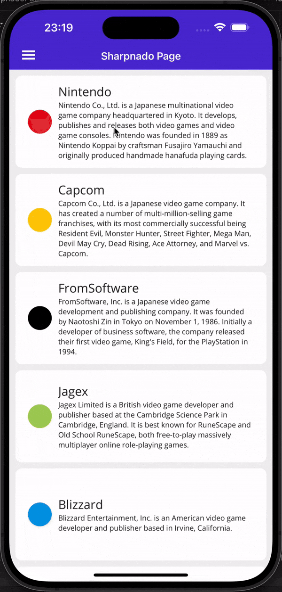

# This repository has been archived due to the feature being implemented & merged to the [Maui.CommunityToolkit](https://github.com/CommunityToolkit/Maui/pull/1673) project, please use the `TouchBehavior` in the toolkit instead.

# Maui.TouchEffect (Archived)

Maui port of TouchEffect from Xamarin Community Toolkit

> The aim of this library is to provide temporary support for the touch effect without having to take a dependency on [XCT's MauiCompat](https://devblogs.microsoft.com/xamarin/introducing-net-maui-compatibility-for-the-xamarin-community-toolkit/) library. My results of using the compat library have been extremely tempramental, alot of the times the touch effect does not work and due to the packages target framework (net6) & age (2 years old) I figured a new port would be the best option. When [CommunityToolkit.Maui](https://github.com/CommunityToolkit/Maui) eventually releases this feature I will archive this repository.

This library supports the following platforms:

| Platform     | Supported |
| ------------ | --------- |
| iOS          | ✅         |
| Android      | ✅         |
| Mac Catalyst | ❌         |
| Windows      | ❌         |
| Tizen        | ❌         |

Due to the temporary nature of this library, I will not be adding support for any platforms I do not personally need. I am open to PR's but MCT are aiming for a NET8 release of TouchEffect so this library will only be kicking around for a matter of weeks/months.

## Install

- Install Maui.TouchEffect package

- In your `MauiProgram.cs`, call `UseMauiTouchEffect`:
  ```diff
  var builder = MauiApp.CreateBuilder();
          builder
              .UseMauiApp<App>()
  ++          .UseMauiTouchEffect()
              .ConfigureFonts(fonts =>
              {
                  fonts.AddFont("OpenSans-Regular.ttf", "OpenSansRegular");
                  fonts.AddFont("OpenSans-Semibold.ttf", "OpenSansSemibold");
              });
  ```

  

## Usage

See the samples app from this project, it is a port of the `TouchEffectPage` from the XCT samples app.


Declare xmlns:

```xml
xmlns:touch="http://axemasta.com/schemas/2023/toucheffect"
```

Use the same API as XCT:

```xml
<StackLayout
    touch:TouchEffect.AnimationDuration="250"
    touch:TouchEffect.AnimationEasing="{x:Static Easing.CubicInOut}"
    touch:TouchEffect.Command="{Binding Command, Source={x:Reference Page}}"
    touch:TouchEffect.PressedOpacity="0.6"
    touch:TouchEffect.PressedScale="0.8"
    HorizontalOptions="CenterAndExpand"
    Orientation="Horizontal">
    <BoxView
        HeightRequest="20"
        WidthRequest="20"
        Color="Gold" />
    <Label Text="The entire layout receives touches" />
    <BoxView
        HeightRequest="20"
        WidthRequest="20"
        Color="Gold" />
</StackLayout>
```


See[`TouchEffect Class`](https://learn.microsoft.com/en-us/dotnet/api/xamarin.communitytoolkit.effects.toucheffect?view=xamarin-community-toolkit-sdk) for complete api documentation.

I added a reproduction to hunt an issue i was experiencing on iOS when using in conjunction with the sharpnado collection view. Turns out sharpnado was nothing to do with it and the input transparency was not being set when using a `Border` with a nested `Layout`. Below is the collection view page demonstrating the touch effect on a repeater view.

| iOS                                                          | Android                                                      |
| ------------------------------------------------------------ | ------------------------------------------------------------ |
|  |  |

## Acknowlegements

This code is ported from:

- [Xamarin Community Toolkit](https://github.com/xamarin/XamarinCommunityToolkit)
- [Aminparsa18 Maui.TouchEffect](https://github.com/aminparsa18/Maui.TouchEffect/tree/master)
